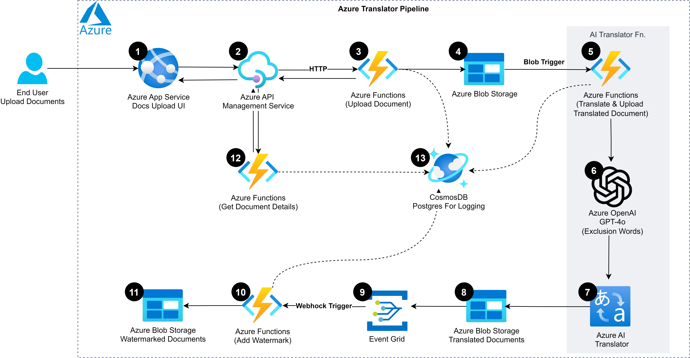

# Azure Translation Service Project

## Project Overview

The Azure Translation Service is a cloud-based solution designed to automate the translation of documents using Azure OpenAI and Azure AI Translator. This service facilitates international business operations by enabling accurate and secure document translation, reducing manual effort, and lowering operational costs.


## Independent Components and Async Requests

This project contains separate components, each of which is independent and works with asynchronous requests. The modular design allows for flexibility, enabling components to be plugged into the solution or removed based on requirements.

- **Web App**: A separate application used to upload documents, choose the target language, and add exclusion words. It can view the uploaded document history and filter by date. This component can be replaced with another web app if desired.
- **Azure API Management**: Handles requests between the frontend and Azure Functions. This component can be separated from the rest of the solution.
- **Azure Functions for Upload**: Manages the document upload scenario. It can be used independently or integrated with other components.
- **Azure Function Translate**: Manages the translation process. This function reads the document based on a blob trigger and uses Azure OpenAI GPT-4o to extract specific document features, such as addresses. It then creates a glossary with the extracted results from GPT-4o. The function passes the document, glossary, and metadata to Azure AI Translator and writes the translated document into Azure Blob Storage. This function can be integrated into the pipeline or used separately.
- **Azure Function for Watermark**: Handles the addition of watermarks to documents. This function can be used independently or removed based on specific needs.

## Solution Walkthrough

The Azure Translator Pipeline is an integrated cloud-based solution designed to streamline the document translation and management process. Users upload documents via an Azure App Service interface. The uploaded documents are processed by Azure API Management and stored in Azure Blob Storage using Azure Functions. Azure OpenAI GPT-4o extracts exclusion words using prompt engineering to identify patterns such as addresses, building a glossary for exclusion. This glossary is generated both from GPT-4o and manual entries from the user interface. These exclusion words are then used by Azure AI Translator for accurate translation.

Azure Functions add watermarks to the translated documents, converting them to PDF if necessary. All document versions, including original, translated, and watermarked, are stored in Azure Blob Storage. Detailed logs of document processing are retrieved from Azure Cosmos DB for PostgreSQL, which stores transaction logs, document paths, and extracted exclusion words. This solution uses Azure's comprehensive services to provide a scalable, secure, and efficient workflow for document translation and management, suitable for enterprise environments.

The average time for document processing is between 3-5 minutes. The pipeline supports parallel invocation as all the requests are asynchronous. For document limits, please refer to the Azure Quotas and Limits documentation.



## Components and Their Roles

| #  | Component                                                                                     | Description                                                                                                                                                      | Role/Functionality                                                                                                                                                                                                                             |
|----|-----------------------------------------------------------------------------------------------|------------------------------------------------------------------------------------------------------------------------------------------------------------------|-----------------------------------------------------------------------------------------------------------------------------------------------------------------------------------------------------------------------------------------------|
| 1  | [Azure App Service](https://learn.microsoft.com/en-us/azure/app-service/)                     | A cloud platform for building, deploying, and scaling web apps and APIs. It supports multiple programming languages and provides built-in security, load balancing, and auto-scaling. | Allows end-users to upload documents via a web application. Provides the user interface for document uploads.                                                                                                   |
| 2  | [Azure API Management Service](https://learn.microsoft.com/en-us/azure/api-management/)       | Manages, secures, and analyzes APIs with features like an API gateway, developer portal, and analytics. | Processes uploaded documents for further handling.                                                                                                                   |
| 3  | [Azure Functions (Upload Document)](https://learn.microsoft.com/en-us/azure/azure-functions/) | A serverless compute service for running event-triggered code without provisioning or managing infrastructure.                                                     | Uploads the document to Azure Blob Storage.                                                                                                                                                                                     |
| 4, 8, 11 | [Azure Blob Storage](https://learn.microsoft.com/en-us/azure/storage/blobs/)             | A service for storing large amounts of unstructured data, such as text or binary data.                                                       | Stores original, translated, and watermarked documents.                                                                                                                                                                                   |
| 5  | [Azure Functions (Translate & Upload Translated Document)](https://learn.microsoft.com/en-us/azure/azure-functions/) | A serverless compute service for running event-triggered code without provisioning or managing infrastructure.                                                     | Parses the document, extracts exclusion words using Azure OpenAI GPT-4o, translates the document using Azure AI Translator, and uploads the translated version back to Azure Blob Storage. |
| 6  | [Azure OpenAI](https://learn.microsoft.com/en-us/azure/ai-services/openai/)                   | Provides access to OpenAI's models, including GPT-4o, GPT-4, DALLE-3, and Embeddings. Integrates with Azure's infrastructure, offering natural language processing capabilities with enterprise-grade security and features. | Extracts exclusion words (e.g., addresses) for the translation process.                                                                             |
| 7  | [Azure AI Translator](https://learn.microsoft.com/en-us/azure/ai-services/translator/)        | A cloud-based machine translation service that supports a wide range of languages and dialects.                                             | Handles the actual translation of the document while preserving its layout and structure. |
| 9  | [Azure Event Grid](https://learn.microsoft.com/en-us/azure/event-grid/overview)        | A highly scalable, fully managed Pub/Sub message distribution service offering flexible message consumption patterns using MQTT and HTTP protocols.|  Enables clients to publish and subscribe to messages, integrate applications, and build event-driven serverless architectures, supporting IoT solutions and event-driven systems.|
| 11  | [Azure Functions (Add Watermark)](https://learn.microsoft.com/en-us/azure/azure-functions)    | A serverless compute service that allows you to run event-triggered code without having to explicitly provision or manage infrastructure.       | Converts .docx to .pdf (if needed), then adds the watermark. If the document is already a PDF, it directly adds the watermark.                                                                                                               |
| 12 | [Azure Functions (Get Document Details)](https://learn.microsoft.com/en-us/azure/azure-functions) | A serverless compute service that allows you to run event-triggered code without having to explicitly provision or manage infrastructure.       | Retrieves details about the processed documents from Cosmos DB.                                                                                                                                                                  |
| 13 | [Azure Cosmos DB for PostgreSQL](https://learn.microsoft.com/en-us/azure/cosmos-db/postgresql/) | Combines the capabilities of PostgreSQL with the global distribution, scalability, and enterprise features of Azure Cosmos DB. Provides high availability, automatic scaling, and integrated security for PostgreSQL databases. | Stores transaction logs about each processed document, including paths and timestamps. Used for logging and transaction analysis.            |

## Folder Structure


### 1. [document-translate-web](./document-translate-web/)

This folder includes:

- `src/`: Source code for the web app.
  - `index.html`: Main HTML file providing the user interface for the web app.
  - `styles.css`: CSS file for styling the web app interface.
  - `app.js`: JavaScript file for handling user interactions and making API requests.
  - `api_endpoints.py`: Python script defining the API endpoints for the web app.
  - `utils.py`: Utility functions for various tasks in the web app.
- `tailwind.config.js`: Configuration for Tailwind CSS.

### 2. [document-upload-function](./document-upload-function/)

This folder includes:

- `.funcignore`: Specifies files to ignore when deploying to Azure Functions.
- `.gitignore`: Specifies files to ignore in Git.
- `.pylintrc`: Configuration for pylint.
- `database_handler.py`: Helper functions for interacting with the database.
- `function_app.py`: Main script defining the HTTP-triggered Azure Functions for file uploads and retrieving logs.
- `host.json`: Configuration file for the function app host.
- `local.settings.json`: Local settings for development.
- `README.md`: Documentation for the function app.
- `requirements.txt`: Python dependencies for the function.
- `utils.py`: Utility functions for handling file uploads, temporary storage, and logging.


### 3. [document-translate-function](./document-translate-function/)

This folder includes:

- `document_translate_function.py`: Main script defining the blob-triggered Azure Function for document translation.
- `environment_variables.py`: Script for managing environment variables.
- `blob_handler.py`: Utility functions for handling blob storage operations.
- `document_processing.py`: Functions for processing document content and uploading data.
- `translation_service.py`: Functions for starting and checking the status of translation jobs.
- `database_helper.py`: Helper functions for interacting with the database.
- `gpt_handler.py`: Functions for interacting with the Azure OpenAI GPT-4o model.
- `host.json`: Configuration file for the function app host.
- `local.settings.json`: Local settings for development.
- `requirements.txt`: Python dependencies for the function.

### 4. [document-watermark-function](./document-watermark-function/)

This folder includes:

- `.dockerignore`: Specifies files to ignore when building Docker images.
- `.funcignore`: Specifies files to ignore when deploying to Azure Functions.
- `.gitignore`: Specifies files to ignore in Git.
- `.pylintrc`: Configuration for pylint.
- `blob_handler.py`: Utility functions for handling blob storage operations.
- `database_helper.py`: Helper functions for interacting with the database.
- `Dockerfile`: Dockerfile for building the function app image.
- `environment_variables.py`: Script for managing environment variables.
- `function_app.py`: Main script defining the Azure Function for adding watermarks to documents.
- `host.json`: Configuration file for the function app host.
- `local.settings.json`: Local settings for development.
- `README.md`: Documentation for the function app.
- `requirements.txt`: Python dependencies for the function.

## Getting Started

### Prerequisites

- Azure Subscription
- Azure Storage Account
- Azure Functions
- Azure Cosmos DB for PostgreSQL
- Azure OpenAI Service
- Azure AI Translator Service

### Deployment

1. **Clone the repository**:
   ```bash
   git clone <repository-url>
   cd azure-translation-service
   ```

2. **Set up environment variables**:
   - Configure your environment variables in the `environment_variables.py` file for the Azure services used in the project.

3. **Deploy Azure Functions**:
   - Use the Azure CLI or Azure Portal to deploy the functions in each folder to your Azure subscription.

4. **Deploy the web application**:
   - Deploy the web application files in the `document-translate-web` folder to an Azure App Service instance.

### WebApp Features:


1. **Upload Documents**:
   - Access the web app and upload documents via the provided interface.
   
2. **Select Target Language**:
   - Choose the desired target language for translation.
   
3. **Download Translated Documents**:
   - Download the translated documents with watermarks from the web app interface.

4. **Manage Exclusion Words**:
   - Provide a list of addresses or words to be excluded from translation using the web app interface.

5. **View Logs**:
   - Access detailed logs of document processing from the web app.